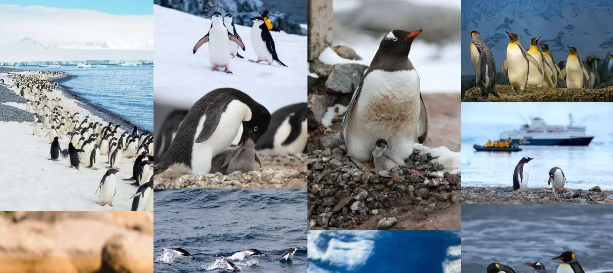
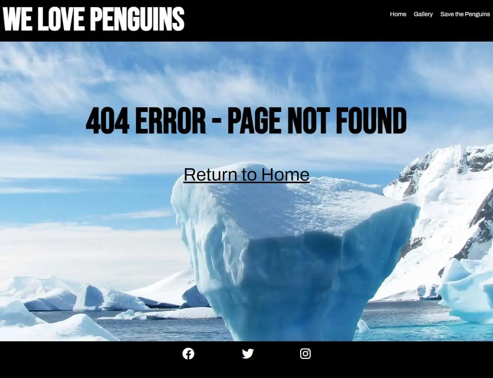

# We Love Penguins

We Love Penguins is a site for a fictional conservation society that provides the oppurtunity for people to find out more about the work being done to protect penguins from climate change related threats, and to become more involved in this work. We Love Penguins provides some facts about the main species of penguins that inhabit Antarctica, and an explanation of how climate change affects them.

The site can be accessed [here](https://bezabu.github.io/bb-penguin/).

## Features

### Existing Features

- Navigation Bar

  - Found at the top of all three pages. It allows the user to navigate to the gallery page, the sign-up page and the home page without having to use the browser's back button.

  

- Landing Page

  - The landing page includes a picture of the main subjects (penguins) in their habitat. Three short sentances overlay this image urging the user to find out more. These messages fade in to attract the user's attention. The third message is a link to a lower part of the page.

  

- Penguins Section

  - Below the fold is where the user can find information about penguins. The user can learn about different species of penguin and how they live.

  

  - Further down the page the user can learn about the goals of the organisation and what they can do to contribute.

  

- Footer

  - Found at the bottom of the page.

  

- Gallery

  - The gallery will provide the user with pictures of penguins. The responsive design ensures that each image will still be easily viewable on a small screen.
  - When the user moves the cursor over an image it will zoom slightly, enabling the user to see it better.

  

- Signup form

  - 

- Favicon

  - To help make the site stand out among other tabs, it has it's own favicon.

  

- Custom 404 Page

  - A custom 404 page has been included to help the user get back to the Landing page.

  

## Testing

- Check all media queries function correctly in different browsers (Chrome, Firefox, Edge, Opera)

  - Test:
    a. Open the website in a browser
    b. Right click on the page and select 'Inspect' or 'Inspect element'
    c. Slowly resize the responsive window down to 280 and back again, observing changes at each breakpoint
  - Result:
    - All media queries work correctly

- Check all navigation links point to correct pages

  - Test:
    a. Open the website in a browser
    b. Click on all links in the navigation bar (Home, Gallery, Save the Penguins) from each page to ensure they lead to the correct pages.
  - Result:
    - All links work correctly

- Check all external links point to correct pages and open in a new tab

  - Test:
    a. Open the website in a browser
    b. Click on all links in the footer (Facebook, Twitter and Instagram) from each page to ensure they lead to the correct pages and open in a new tab.
  - Result:
    - All links work correctly

- Check sign up form validation works correctly

  - Test:
    a. Open the website in a browser
    b. Navigate to the sign up page
    c. Click on the Sign up button without entering any information. Observe the prompt for each part of the form where input is required.
  - Result:
    - All form inputs that require input (Name, surname, email address, how did you hear about us) prompt the user for input if not filled in properly

- Check sign up form sends correct data to formdump
  - Test:
    a. Open the website in a browser
    b. Navigate to the sign up page
    c. Fill out the form making sure to try each variation of the 'how did you hear about us' and 'favourite penguin' inputs
    d. Observe the code institute form dump to ensure each name and value is correct
  - Result:
    - All names and values are correct

## Validator Testing

- HTML

  - No errors were returned when passing through the [W3C HTML Validator](https://validator.w3.org/nu/?doc=https%3A%2F%2Fbezabu.github.io%2Fbb-penguin%2F)

- CSS

  - No errors were returned when passing through the [W3C CSS Validator](https://jigsaw.w3.org/css-validator/validator?uri=https%3A%2F%2Fbezabu.github.io%2Fbb-penguin%2F&profile=css3svg&usermedium=all&warning=1&vextwarning=&lang=en)

- Accessibility

  - Two alerts returned when passing through the [WAVE Web Accessibility Evaluation Tool](https://wave.webaim.org/report#/https://bezabu.github.io/bb-penguin/index.html)
    - A section with id fixed-image had white text over a background image. Adding a background-color property \_ _below_ \_ the background-image property cleared this alert.
    - The 'Become a member' link which links to the sign-up page and the 'Save the Penguins' link in the navigation bar was flagged as redundant links. I got around this by having one of them link specifically to the header in the sign-up page. This clearede the alert.
  - No errors or contrast errors were returned.

## Technologies

- HTML has been used to structure the web site
- CSS has been used to style the web site
- [Chrome dev tools](https://developer.chrome.com/docs/devtools/) has been used for testing, debugging
- [FontAwesome](https://fontawesome.com/) has been used for the icons in the footer and for custom bullet points
- [Google fonts](https://fonts.google.com/) has been used to import the fonts **Archivo**, **Bebas Neue** and **Fjalla One**
- [Iconifier](https://iconifier.net/) has been used to create a favicon
- [Techsini mockup generator](https://techsini.com/multi-mockup/index.php) has been used to create the mockup for the readme file
- [Github](https://github.com/) has been used to store code, images and other contents
- [Gitpages](https://pages.github.com/) was used to deploy the website
- [Git](https://git-scm.com/) was used for version control, pushing contents to github
- [Codeanywhere](https://app.codeanywhere.com/)was used as IDE
- [Wave Web Accessibility Evaluation tool](https://wave.webaim.org/) was used to test the accessibility of the web site
- [Lighthouse](https://developer.chrome.com/docs/lighthouse/overview/#devtools) was used to run an audit of the web site
- [W3C Markup Validation Service](https://validator.w3.org/) was used to check HTML
- [W3C CSS Validation Service](https://jigsaw.w3.org/css-validator/) was used to check CSS

## Deployment

- The site was deployed to GitHub pages. The steps to deploy are as follows:

  - In the GitHub repository, navigate to the Settings tab
  - From the source section drop-down menu, select the Master Branch
  - Once the master branch has been selected, the page will be automatically refreshed with a detailed ribbon display to indicate the successful deployment.

- The live link can be found here: [https://bezabu.github.io/bb-penguin/](https://bezabu.github.io/bb-penguin/)

## Credit

### Content

- Text is from [Wikipedia](https://en.wikipedia.org/wiki/Penguin), [World Wide Fund for Nature (WWF)](https://www.wwf.org.uk/search?keys=penguin) and [NASA](https://climate.nasa.gov/vital-signs/ice-sheets/#:~:text=Key%20Takeaway%3A,adding%20to%20sea%20level%20rise.)

  - Wikipedia Articles:

    - [Penguins](https://en.wikipedia.org/wiki/Penguin)
    - [Emperor Penguin](https://en.wikipedia.org/wiki/Emperor_penguin)
    - [Adelie Penguin](https://en.wikipedia.org/wiki/Ad%C3%A9lie_penguin)
    - [King Penguin](https://en.wikipedia.org/wiki/King_penguin)
    - [Climate change in ANtarctica](https://en.wikipedia.org/wiki/Climate_change_in_Antarctica)

  - WWF pages:
    - [Emperor Penguins](https://www.wwf.org.uk/learn/fascinating-facts/emperor-penguins)
    - [Emperor Penguins](https://www.wwf.org.uk/updates/emperor-penguins-toughest-birds-planet)
    - [Adelie Penguins](https://www.wwf.org.uk/learn/wildlife/adelie-penguins)
    - [Adelie Penguins](https://www.wwf.org.uk/learn/fascinating-facts/adelie-penguins)
    - [Protecting Penguins](https://www.wwf.org.uk/updates/working-together-protect-penguins)

### Images

- The Images used in the Landing page, gallery, custom 404 page and sign up page taken from [Pexels](https://www.pexels.com/):

  - [emperor-family-3.webp](https://www.pexels.com/photo/cold-nature-cute-ice-52509/), [icy-huddle.jpg](https://www.pexels.com/photo/group-of-penguins-on-ice-46235/), [king-line-2.webp](https://www.pexels.com/photo/animal-beaks-bird-cold-209096/), [wide-ice.jpg](https://www.pexels.com/photo/cold-nature-cute-ice-48814/), [african-beach.jpg](https://www.pexels.com/photo/an-african-penguin-on-a-shore-9085029/), [ice-sea.webp](https://www.pexels.com/photo/iceberg-during-daytime-53389/)

- The Images used in the Landing page, gallery taken from [Unsplash](https://unsplash.com/):

  - [fiordland-swim2.webp](https://unsplash.com/photos/aRD43BMqAp8), [adelie-beach-ice.jpg](https://unsplash.com/photos/0eYHcCrcFNM), [chinstrap-penguins.jpg](https://unsplash.com/photos/3Xd5j9-drDA), [yellow-eyed-penguin.jpg](https://unsplash.com/photos/Ak81Vc-kCf4), [huddle-king](https://unsplash.com/photos/4CVMWrWh3xU), [baby-gentoo.webp](https://unsplash.com/photos/HrLHBqrnefc), [chinstrap-splash.webp](https://unsplash.com/photos/t5IN6vx0cLs), [adelie-feed.webp](https://unsplash.com/photos/ujWrNI4mFww), [gentoo-boat.jpg](https://unsplash.com/photos/-Eu3Iud63rA)

- Images used in the Landing Page and gallery taken from [Wikipedia](https://en.wikipedia.org/wiki/Main_Page) under creative commons 2.0:

  - [penguins-walking-2.webp](https://en.wikipedia.org/wiki/File:Penguins_walking_-Moltke_Harbour,_South_Georgia,_British_overseas_territory,_UK-8.jpg),
    [emperor-family2.webp](https://en.wikipedia.org/wiki/File:Aptenodytes_forsteri_-Snow_Hill_Island,_Antarctica_-adults_and_juvenile-8.jpg), [emperor-jump.jpg,](https://en.wikipedia.org/wiki/Princess_Ragnhild_Coast#/media/File:Penguin_in_Antarctica_jumping_out_of_the_water.jpg)

- All text and images used in this project are for non commercial, educational purposes only.

### Code

- Instructions on how to implement font awesome icons as bullet points was taken from [the answers to this Stack Overflow question](https://stackoverflow.com/questions/12468359/using-font-awesome-icon-for-bullet-points-with-a-single-list-item-element)

- Instructions on how to implement a zoom effect on hovering over images was taken from [This W3Schools page](https://www.w3schools.com/howto/howto_css_zoom_hover.asp)
