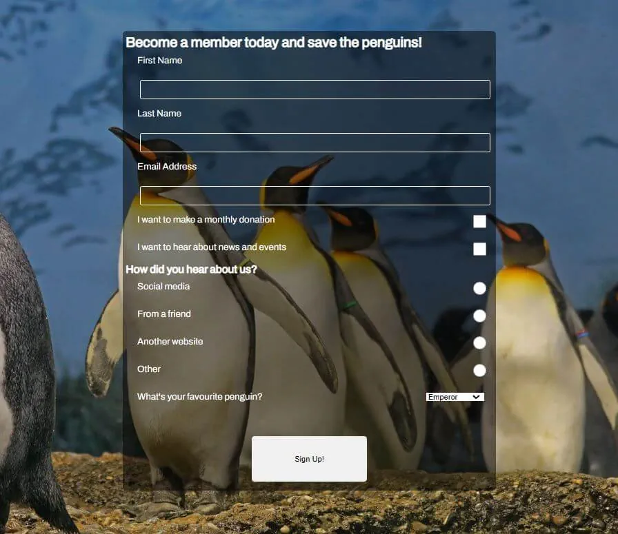

# We Love Penguins

We Love Penguins is a site for a fictional conservation society that provides the oppurtunity for people to find out more about the work being done to protect penguins from climate change related threats, and to become more involved in this work. We Love Penguins provides some facts about the main species of penguins that inhabit Antarctica, and an explanation of how climate change affects them.

The site can be accessed [here](https://bezabu.github.io/bb-penguin/).

## Features

### Existing Features

- Navigation Bar

  - Found at the top of all three pages. It allows the user to navigate to the gallery page, the sign-up page and the home page without having to use the browser's back button.

  

- Landing Page

  - The landing page includes a picture of the main subjects (penguins) in their habitat. Three short sentances overlay this image urging the user to find out more. These messages fade in to attract the user's attention. The third message is a link to a lower part of the page.

  

- Penguins Section

  - Below the fold is where the user can find information about penguins. The user can learn about different species of penguin and how they live.

  

  - Further down the page the user can learn about the goals of the organisation and what they can do to contribute.

  

- Footer

  - Found at the bottom of the page.

  

- Gallery

  - The gallery will provide the user with pictures of penguins. The responsive design ensures that each image will still be easily viewable on a small screen.
  - When the user moves the cursor over an image it will zoom slightly, enabling the user to see it better.

  

- Signup form

  - 

- Favicon

  - To help make the site stand out among other tabs, it has it's own favicon.

  

## Testing

- Check all navigation links point to correct pages

  - Test:
    a. Open the website in a browser
    b. Click on all links in the navigation bar (Home, Gallery, Save the Penguins) from each page to ensure they lead to the correct pages.
  - Result:
    - All links work correctly

- Check all external links point to correct pages
  - Test:
    a. Open the website in a browser
    b. Click on all links in the footer (Facebook, Twitter and Instagram) from each page to ensure they lead to the correct pages and open in a new tab.
  - Result:
    - All links work correctly

## Validator Testing

- HTML

  - No errors were returned when passing through the [W3C HTML Validator](https://validator.w3.org/nu/?doc=https%3A%2F%2Fbezabu.github.io%2Fbb-penguin%2F)

- CSS

  - No errors were returned when passing through the [W3C CSS Validator](https://jigsaw.w3.org/css-validator/validator?uri=https%3A%2F%2Fbezabu.github.io%2Fbb-penguin%2F&profile=css3svg&usermedium=all&warning=1&vextwarning=&lang=en)

- Accessibility

  - No errors, contrast errors or alerts were returned when passing through the [WAVE Web Accessibility Evaluation Tool](https://wave.webaim.org/report#/https://bezabu.github.io/bb-penguin/index.html)

technologies
HTML
CSS
chrome dev tools
fontawesome
google fonts
iconifier.net for favicon
https://techsini.com/ for mockup
github for storage
gitpages for deployment
wave web accessory tool
lighthouse
w3 html & css validators

deployment steps

credit
content paraphrased/verbatim from wikipedia/wwf
images from pexels, etc

tutorial followed to create custom bulletpoints with fontawesome
https://love2dev.com/blog/customize-bulleted-list/#:~:text=Changing%20the%20Bullet%20to%20an,you%20want%20as%20your%20bullets.

acknowledgements
